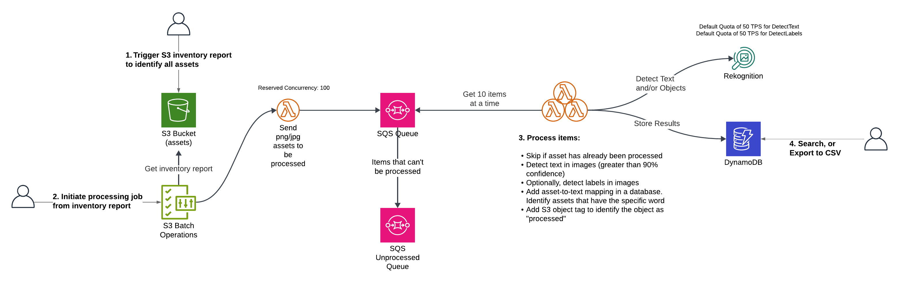

# Detect Text in Images

This CDK project provides the necessary code to run existing S3 assets through image analysis provided by Amazon Rekognition. This particular solution aims to find a specific word (Text Detection) in the images, saving the results in a DynamoDB table to easily identify all the assets that contain that specific word. This can be useful for finding text in movie posters, advertisements, and retail.

Make sure to update the word to detect, and the existing bucket name in the `detect-image-attributes-stack.ts` file.

To start processing, create an S3 Batch Job with an S3 Inventory Report as the input, and configure it to invoke the S3 Batch SQS Lambda function.

The `cdk.json` file tells the CDK Toolkit how to execute your app.

## Useful commands

* `npm run build`   compile typescript to js
* `npm run watch`   watch for changes and compile
* `npm run test`    perform the jest unit tests
* `npx cdk deploy`  deploy this stack to your default AWS account/region
* `npx cdk diff`    compare deployed stack with current state
* `npx cdk synth`   emits the synthesized CloudFormation template
